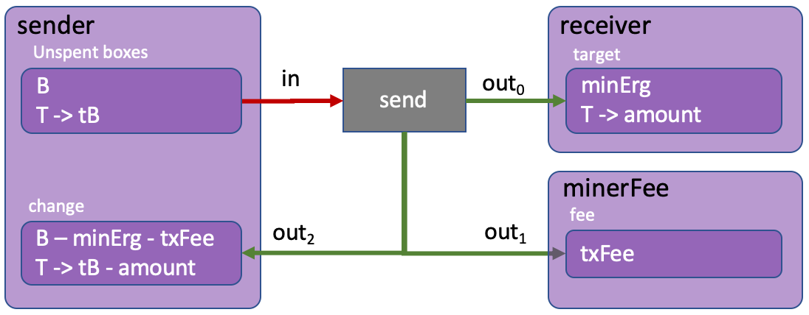
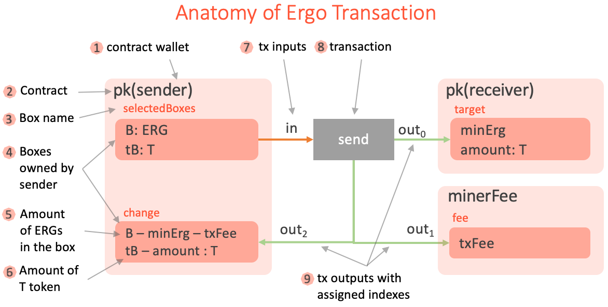
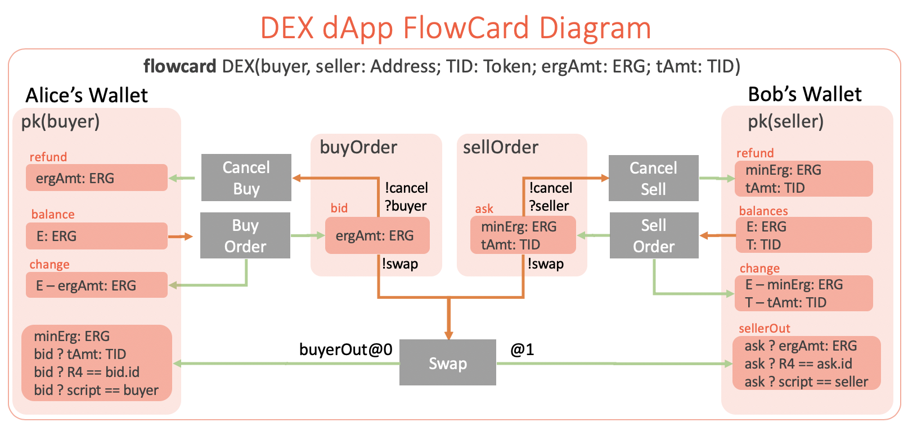

# FlowCards: A Declarative Framework for Development of Ergo dApps

> With thanks to [Robert Kornacki](https://github.com/robkorn) for polishing of the draft.

## Introduction 

[ErgoScript](https://ergoplatform.org/docs/ErgoScript.pdf) is the smart contract language used
by the Ergo blockchain. While it has concise syntax adopted from Scala/Kotlin, it still
may seem confusing at first because conceptually ErgoScript is quite different compared to
conventional languages which we all know and love. This is because Ergo is a UTXO based
blockchain, whereas smart contracts are traditionally associated with account based
systems like Ethereum. However, Ergo's transaction model has many advantages over the account
based model and with the right approach it can even be significantly easier to develop Ergo contracts
than to write and debug Solidity code.

Below we will cover the key aspects of the Ergo contract model which makes it different:

##### Paradigm   
The account model of Ethereum is imperative. This means that the typical task of sending coins from
Alice to Bob requires changing the balances in storage as a series of operations. Ergo's UTXO
based programming model on the other hand is declarative. ErgoScript contracts specify conditions for
a transaction to be accepted by the blockchain (not changes to be made in the storage
state as result of the contract execution).

##### Scalability
In the account model of Ethereum both storage changes and validity checks are performed
_on-chain_ during code execution. In contrast, Ergo transactions are created
_off-chain_ and only validation checks are performed on-chain thus reducing the amount of
operations performed by every node on the network. In addition, due to immutability of the
transaction graph, various optimization strategies are possible to improve throughput
of transactions per second in the network. Light verifying nodes are also possible thus
further facilitating scalability and accessibility of the network.

##### Shared state
The account-based model is reliant on shared mutable state which is known to lead
to complex semantics (and subtle million dollar bugs) in the context of concurrent/
distributed computation. Ergo's model is based on an immutable graph of transactions. This
approach, inherited from Bitcoin, plays well with the concurrent and distributed nature of
blockchains and facilitates light trustless clients.

##### Expressive Power
Ethereum advocated execution of a turing-complete language on the blockchain. It
theoretically promised unlimited potential, however in practice severe 
limitations came to light from excessive blockchain bloat, subtle multi-million dollar bugs, gas costs which
limit contract complexity, and other such problems. Ergo on the flip side extends UTXO to enable
turing-completeness while limiting the complexity of the ErgoScript language itself. The same
expressive power is achieved in a different and more semantically sound way.

With the all of the above points, it should be clear that there are a lot of benefits to the model Ergo is using.
In the rest of this article I will introduce you to the concept of FlowCards - a dApp developer component 
which allows for designing complex Ergo contracts in a declarative and visual way.

## From Imperative to Declarative

In the imperative programming model of Ethereum a transaction is a sequence of operations
executed by the Ethereum VM. The following [Solidity
function](https://solidity.readthedocs.io/en/develop/introduction-to-smart-contracts.html#subcurrency-example)
implements a transfer of tokens from `sender` to `receiver`. The transaction starts when
`sender` calls this function on an instance of a contract and ends when the function
returns.

```
// Sends an amount of existing coins from any caller to an address
function send(address receiver, uint amount) public {
    require(amount <= balances[msg.sender], "Insufficient balance.");
    balances[msg.sender] -= amount;
    balances[receiver] += amount;
    emit Sent(msg.sender, receiver, amount);
}
```

The function first checks the pre-conditions, then updates the storage (i.e. balances) and
finally publishes the post-condition as the `Sent` event. The gas which is consumed by the
transaction is sent to the miner as a reward for executing this transaction.

Unlike Ethereum, a transaction in Ergo is a data structure holding a list of input coins
which it spends and a list of output coins which it creates preserving the total balances of
ERGs and tokens (in which Ergo is similar to Bitcoin).

Turning back to the example above, since Ergo natively supports tokens, therefore for this
specific example of sending tokens we don't need to write any code in ErgoScript. Instead
we need to create the 'send' transaction shown in the following figure, which describes
the same token transfer but declaratively.



The picture visually describes the following steps, which the network user needs to
perform:
1) Select unspent sender's boxes, containing in total `tB >= amount` of tokens and `B >=
txFee + minErg` ERGs.
2) Create an output `target` box which is protected by the `receiver` public key with `minErg`
ERGs and `amount` of `T` tokens.
3) Create one _fee_ output protected by the `minerFee` contract with `txFee` ERGs.
4) Create one _change_ output protected by the `sender` public key, containing
`B - minErg - txFee` ERGs and `tB - amount` of `T` tokens.
5) Create a new transaction, sign it using the sender's secret key and send to the Ergo
network.

What is important to understand here is that all of these steps are preformed _off-chain_ (for
example using [Appkit](https://github.com/aslesarenko/ergo-appkit) Transaction API) by the
user's application. Ergo network nodes don't need to repeat this transaction creation process,
they only need to validate the already formed transaction. ErgoScript contracts are stored in
the inputs of the transaction and check spending conditions. The node executes the
contracts _on-chain_ when the transaction is validated. The transaction is valid if all
of the conditions are satisfied.

Thus, in Ethereum when we "send amount from sender to recipient" we are literally
editing balances and updating the storage with a concrete set of commands. This happens
_on-chain_ and thus a new transaction is also created _on-chain_ as the result of this process. 

In Ergo (as in Bitcoin) transactions are created _off-chain_ and the network nodes only
verify them. The effects of the transaction on the blockchain state is that input coins
(or Boxes in Ergo's parlance) are removed and output boxes are added to the
[UTXO](https://en.wikipedia.org/wiki/Unspent_transaction_output) set.

In the example above we don't use an ErgoScript contract but instead assume a signature check is
used as the spending pre-condition. However in more complex application scenarios we of course need
to use ErgoScript which is what we are going to discuss next.

## From Changing State to Checking Context 

In the `send` function example we first checked the pre-condition (`require(amount <=
balances[msg.sender],...)`) and then changed the state (i.e. update balances
`balances[msg.sender] -= amount`). This is typical in Ethereum transactions. Before
we change anything we need to check if it is valid to do so.

In Ergo, as we discussed previously, the state (i.e. UTXO set of boxes) is changed implicitly when a
valid transaction is included in a block. Thus we only need to check the pre-conditions before
the transaction can be added to the block. This is what ErgoScript contracts do.

It is not possible to "change the state" in ErgoScript because it is a language to check
pre-conditions for spending coins. ErgoScript is a purely functional language without side
effects that operates on immutable data values. This means all the inputs, outputs and
other transaction parameters available in a script are immutable. This, among other
things, makes ErgoScript a very simple language that is easy to learn and safe to use. Similar to
Bitcoin, each input box contains a script, which should return the `true` value in
order to 1) allow spending of the box (i.e. removing from the UTXO set) and 2) adding the
transaction to the block.

If we are being pedantic, it is therefore incorrect (strictly speaking) to think of ErgoScript as the language of
Ergo contracts, because it is the language of propositions (logical predicates, formulas,
etc.) which protect boxes from "illegal" spending. Unlike Bitcoin, in Ergo the whole
transaction and a part of the current blockchain context is available to every script. Therefore
each script may check which outputs are created by the transaction, their ERG and token
amounts (we will use this capability in our example DEX contracts), current block number
etc.

_In ErgoScript you define the conditions of whether changes (i.e. coin spending) are allowed 
to happen in a given context. This is in contrast to programming the changes
imperatively in the code of a contract._
 
While Ergo's transaction model unlocks a whole range of applications like (DEX, DeFi
Apps, LETS, etc), designing contracts as pre-conditions for coin spending (or guarding
scripts) directly is not intuitive. In the next sections we will consider a useful graphical
notation to design contracts declaratively using _FlowCard Diagrams_, which is a visual
representation of executable components (FlowCards). 

_FlowCards aim to radically simplify dApp development on the Ergo platform by
providing a high-level declarative language, execution runtime, storage format and
a graphical notation_.

We will start with a high level of diagrams and go down to FlowCard specification.

## FlowCard Diagrams

The idea behind FlowCard diagrams is based on the following observations: 1) An Ergo box
is immutable and can only be spent in the transaction which uses it as an input. 2) We
therefore can draw a flow of boxes through transactions, so that boxes _flowing in_ to the
transaction are spent and those _flowing out_ are created and added to the UTXO. 3) A
transaction from this perspective is simply a transformer of old boxes to the new ones
preserving the balances of ERGs and tokens involved.

The following figure shows the main elements of the Ergo transaction we've already seen
previously (now under the name of FlowCard Diagram).



There is a strictly defined meaning (semantics) behind every element of _the diagram_,
so that the diagram is a visual representation (or a view) of the underlying executable
component (called FlowCard).

The FlowCard can be used as a reusable component of an Ergo dApp to create and initiate the
transaction on the Ergo blockchain. We will discuss this in the coming sections.

Now let's look at the individual pieces of the FlowCard diagram one by one.

##### 1. Name and Parameters 

Each flow card is given a name and a list of typed parameters. This is similar to a
template with parameters. In the above figure we can see the `Send` flow card which has five parameters.
The parameters are used in the specification.

##### 2. Contract Wallet 

This is a key element of the flow card. Every box has a guarding script. Often it is the
script that checks a signature against a public key. This script is trivial in ErgoScript
and is defined like the `def pk(pubkey: Address) = { pubkey }` template where `pubkey` is
a parameter of the type `Address`. In the figure, the script template is applied to the
parameter `pk(sender)` and thus a concrete wallet contract is obtained. Therefore
`pk(sender)` and `pk(receiver)` yield different scripts and represent _different_ wallets
on the diagram, even though they use the same template.

_Contract Wallet_ contains a set of all UTXO boxes which have a given script derived from
the given script template using flow card parameters. For example, in the figure, the
template is `pk` and parameter `pubkey` is substituted with the `sender' flow card
parameter.
  
##### 3. Contract

Even though a contract is a property of a box, on the diagram we group the boxes by their
contracts, therefore it looks like the boxes belong to the contracts, rather than the
contracts belong to the boxes. In the example, we have three instantiated contracts
`pk(sender)`, `pk(receiver)` and `minerFee`. Note, that `pk(sender)` is the instantiation of the
`pk` template with the concrete parameter `sender` and `minerFee` is the instantiation of
the pre-defined contract which protects the miner reward boxes.

##### 4. Box name

In the diagram we can give each box a name. Besides readability of the diagram, we also use the
name as a synonym of a more complex indexed access to the box in the contract. For
example, `change` is the name of the box, which can also be used in the ErgoScript
conditions instead of `OUTPUTS(2)`. We also use box names to associate spending conditions
with the boxes.

##### 5. Boxes in the wallet

In the diagram, we show boxes (darker rectangles) as belonging to the contract wallets
(lighter rectangles). Each such _box rectangle_ is connected with a grey _transaction
rectangle_ by either <b color="#ED7D31">orange</b> or <b color="#A9D18E">green</b> arrows
or both. An output box (with an incoming green arrow) may include many lines of text where each
line specifies a condition which should be checked as part of the transaction. The first
line specifies the condition on the amount of ERG which should be placed in the box. Other
lines may take one of the following forms:
1) `amount: TOKEN` - the box should contain the given `amount` of the given `TOKEN`
2) `R == value` - the box should contain the given `value` of the given register `R`
3) `boxName ? condition` - the box named `boxName` should check `condition` in its script.

We discuss these conditions in the sections below.

##### 6. Amount of ERGs in the box

Each box should store a minimum amount of ERGs. This is checked when the creating transaction is
validated. In the diagram the amount of ERGs is _always_ shown as the first line (e.g. `B:
ERG` or `B - minErg - txFee`). The value type ascription `B: ERG` is optional and may
be used for readability. When the value is given as a formula, then this formula should be
respected by the transaction which creates the box.

It is important to understand that variables like `amount` and `txFee` are not named
properties of the boxes. They are parameters of the whole diagram and representing some
amounts. Or put it another way, they are shared parameters between transactions (e.g. Sell
Order and Swap transactions from DEX example below share the `tAmt` parameter). So 
the same name is tied to the same value throughout the diagram (this is where the
tooling would help a lot). However, when it comes to _on-chain_ validation of those values,
only explicit conditions which are marked with `?` are transformed to ErgoScript. At the
same time, all other conditions are ensured _off-chain_ during transaction building (for example in an
application using Appkit API) and transaction validation when it is added to the
blockchain.

##### 7. Amount of T token 

A box can store values of many tokens. The tokens on the diagram are named and a `value`
variable may be associated with the token `T` using `value: T` expression. The `value` may
be given by formula. If the formula is prefixed with a box name like `boxName ? formula`,
then it is should also be checked in the guarding script of the `boxName` box. This
additional specification is very convenient because 1) it allows to validate the visual
design automatically, and 2) the conditions specified in the boxes of a diagram are enough
to synthesize the necessary guarding scripts. (more about this
[below](#from-diagrams-to-ergoscript-contracts))

##### 8. Tx Inputs

Inputs are connected to the corresponding transaction by <b color="#ED7D31">orange</b>
arrows. An input arrow may have a label of the following forms:
1) `name@index` - optional name with an index i.e. `fee@0` or `@2`. This is a property of
the target endpoint of the arrow. The name is used in conditions of related boxes
and the `index` is the position of the corresponding box in the INPUTS collection of the
transaction.
2) `!action` - is a property of the source of the arrow and gives a name for an alternative
spending path of the box (we will see this in DEX example)

Because of alternative spending paths, a box may have many outgoing <b
color="#ED7D31">orange</b> arrows, in which case they should be labeled with different
actions.

##### 9. Transaction

A transaction spends input boxes and creates output boxes. The input boxes are given by
the <b color="#ED7D31">orange</b> arrows and the labels are expected to put inputs at the
right indexes in INPUTS collection. The output boxes are given by the <b
color="#A9D18E">green</b> arrows. Each transaction should preserve a strict balance of ERG
values (sum of inputs == sum of outputs) and for each token the sum of inputs >= the sum
of outputs. The design diagram requires an explicit specification of the ERG and token
values for all of the output boxes to avoid implicit errors and ensure better readability.

##### 10. Tx Outputs

Outputs are connected to the corresponding transaction by <b color="#A9D18E">green</b>
arrows. An output arrow may have a label of the following form`name@index`, where an
optional name is accompanied with an index i.e. `fee@0` or `@2`. This is a property of the
source endpoint of the arrow. The name is used in conditions of the related boxes and the
`index` is the position of the corresponding box in the OUTPUTS collection of the transaction.

## Example: Decentralized Exchange (DEX)

Now let's use the above described notation to design a FlowCard for a DEX dApp. It is simple
enough yet also illustrates all of the key features of FlowCard
diagrams which we've introduced in the previous section.

The dApp scenario is shown in the figure below: <br> There are three participants (buyer,
seller and DEX) of the DEX dApp and five different transaction types, which are created by
participants. The buyer wants to swap `ergAmt` of ERGs for `tAmt` of `TID` tokens (or vice
versa, the seller wants to sell `TID` tokens for ERGs, who sends the order first doesn't
matter). Both the buyer and the seller can cancel their orders any time. The DEX off-chain
matching service can find matching orders and create the `Swap` transaction to
complete the exchange.

The following diagram fully (and formally) specifies all of the five transactions that must
be created _off-chain_ by the DEX dApp. It also specifies all of the spending conditions that
should be verified _on-chain_.



Let's discuss the FlowCard diagram and the logic of each transaction in details:

##### Buy Order Transaction

A buyer creates a `Buy Order` transaction. The transaction spends `E` amount of ERGs
(which we will write `E: ERG`) from one or more boxes in the `pk(buyer)` wallet. The
transaction creates a `bid` box with `ergAmt: ERG` protected by the `buyOrder` script. The
`buyOrder` script is synthesized from the specification (see
[below](#from-diagrams-to-ergoscript-contracts)) either manually or automatically by a
tool. Even though we don't need to define the `buyOrder` script explicitly during
designing, at run time the `bid` box should contain the `buyOrder` script as the
guarding proposition (which checks the box spending conditions), otherwise the conditions
specified in the diagram will not be checked.

The `change` box is created to make the input and output sums of the transaction balanced.
The transaction fee box is omitted because it can be added automatically by the tools. In
practice, however, the designer can add the fee box explicitly to the a diagram. It covers
the cases of more complex transactions (like Swap) where there are many ways to pay
the transaction fee.

##### Cancel Buy, Cancel Sell Transactions

At any time, the `buyer` can cancel the order by sending `CancelBuy` transaction. The
transaction should satisfy the guarding `buyOrder` contract which protects the `bid` box.
As you can see on the diagram, both the `Cancel` and the `Swap` transactions can spend the
`bid` box. When a box has spending alternatives (or _spending paths_) then each
alternative is identified by a unique name prefixed with `!` (`!cancel` and `!swap`
for the `bid` box). Each alternative path has specific spending conditions. In our example,
when the `Cancel Buy` transaction spends the `bid` box the `?buyer` condition should be
satisfied, which we read as "the signature for the `buyer` address should be presented in the
transaction". Therefore, only buyer can cancel the buy order. This "signature" condition
is only required for the `!cancel` alternative spending path and not required for `!swap`.

##### Sell Order Transaction

The `Sell Order` transaction is similar to the `BuyOrder` in that it deals with tokens in
addition to ERGs. The transaction spends `E: ERG` and `T: TID` tokens from seller's wallet
(specified as `pk(seller)` contract). The two outputs are `ask` and `change`. The change
is a standard box to balance transaction. The `ask` box keeps `tAmt: TID` tokens for the exchange
and `minErg: ERG` - the minimum amount of ERGs required in every box.

##### Swap Transaction

This is a key transaction in the DEX dApp scenario. The transaction has several spending
conditions on the input boxes and those conditions are included in the `buyOrder` and
`sellOrder` scripts (which are verified when the transaction is added to the
blockchain). However, on the diagram those conditions are not specified in the `bid` and
`ask` boxes, they are instead defined in the output boxes of the transaction. 

This is a convention for improved usability because most of the conditions relate to the properties of
the output boxes. We could specify those properties in the `bid` box, but then we would
have to use more complex expressions.

Let's consider the output created by the arrow labeled with `buyerOut@0`. This label tells
us that the output is at the index `0` in the `OUTPUTS` collection of the transaction and
that in the diagram we can refer to this box by the `buyerOut` name. Thus we can label
both the box itself and the arrow to give the box a name.

The conditions shown in the `buyerOut` box have the form `bid ? condition`, which means
they should be verified _on-chain_ in order to spend the `bid` box. 
The conditions have the following meaning:
- `tAmt: TID` requires the box to have `tAmt` amount of `TID` token
- `R4 == bid.id`  requires R4 register in the box to be equal to id of the `bid` box.
- `script == buyer` requires the `buyerOut` box to have the script of the wallet where it
is located on the diagram, i.e. `pk(buyer)`

Similar properties are added to the `sellerOut` box, which is specified to be at index `1`
and the name is given to it using the label on the box itself, rather than on the arrow.

The `Swap` transaction spends two boxes `bid` and `ask` using the `!swap` spending path on both,
however unlike `!cancel` the conditions on the path are not specified. This is where the
`bid ?` and `ask ?` prefixes come into play. They are used so that the conditions listed in the `buyerOut` and
`sellerOut` boxes are moved to the `!swap` spending path of the `bid` and `ask` boxes
correspondingly.

If you look at the conditions of the output boxes, you will see that they exactly specify
the swap of values between seller's and buyer's wallets. The buyer gets the necessary amount
of `TID` token and seller gets the corresponding amount of ERGs. The `Swap` transaction
is created when there are two matching boxes with `buyOrder` and `sellOrder` contracts.

## From Diagrams To ErgoScript Contracts

What is interesting about FlowCard specifications is that we can use them to automatically
generate the necessary [ErgoTree](https://ergoplatform.org/docs/ErgoTree.pdf) scripts.
With the appropriate tooling support this can be done automatically, but with the lack of
thereof, it can be done manually. Thus, the FlowCard allows us to capture and visually
represent all of the design choices and semantic details of an Ergo dApp. 

What we are going to do next is to mechanically create the `buyOrder` contract from the
information given in the `DEX` flow card. 

Recall that each script is a proposition (boolean valued expression) which should evaluate
to `true` to allow spending of the box. When we have many conditions to be met at the same
time we can combine them in a logical formula using the AND binary operation, and if we have
alternatives (not necessarily exclusive) we can put them into the OR operation.

The `buyOrder` box has the alternative spending paths `!cancel` and `!swap`. Thus the
ErgoScript code should have OR operation with two arguments - one for each spending path.
```
/** buyOrder contract */
{
  val cancelCondition = {}
  val swapCondition = {}
  cancelCondition || swapCondition
}
```
The formula for the `cancelCondition` expression is given in the `!cancel` spending path
of the `buyOrder` box. We can directly include it in the script.
```
/** buyOrder contract */
{
  val cancelCondition = { buyer }
  val swapCondition = {}
  cancelCondition || swapCondition
}
```

For the `!swap` spending path of the `buyOrder` box the conditions are specified in the
`buyerOut` output box of the `Swap` transaction. If we simply include them in the
`swapCondition` then we get a syntactically incorrect script.
```
/** buyOrder contract */
{
  val cancelCondition = { buyer }
  val swapCondition = {
    tAmt: TID &&
    R4 == bid.id &&
    @contract
  }
  cancelCondition || swapCondition
}
```
We can however translate the conditions from the diagram syntax to ErgoScript expressions
using the following simple rules
1) `buyerOut@0` ==> `val buyerOut = OUTPUTS(0)`
2) `tAmt: TID`  ==> `tid._2 == tAmt` where `tid = buyerOut.tokens(TID)`
3) `R4 == bid.id`  ==> `R4 == SELF.id` where `R4 = buyerOut.R4[Coll[Byte]].get` 
4) `script == buyer`  ==> `buyerOut.propositionBytes == buyer.propBytes` 

Note, in the diagram `TID` represents a token id, but ErgoScript doesn't have access to the
tokens by the ids so we cannot write `tokens.getByKey(TID)`. For this reason, when the
diagram is translated into ErgoScript, TID becomes a named constant of the index in
`tokens` collection of the box. The concrete value of the constant is assigned when the
`BuyOrder` transaction with the `buyOrder` box is created. The correspondence and
consistency between the actual tokenId, the `TID` constant and the actual tokens of the
`buyerOut` box is ensured by the _off-chain_ application code, which is completely
possible since all of the transactions are created by the application using FlowCard as a
guiding specification. This may sound too complicated, but this is part of the translation
from diagram specification to actual executable application code, most of which can be
automated.

After the transformation we can obtain a correct script which checks all the required
preconditions for spending the `buyOrder` box. 
```
/** buyOrder contract */
def DEX(buyer: Addrss, seller: Address, TID: Int, ergAmt: Long, tAmt: Long)
{
  val cancelCondition: SigmaProp = { buyer }      // verify buyer's sig (ProveDlog)
  val swapCondition = OUTPUTS.size > 0 && {       // securing OUTPUTS access
    val buyerOut = OUTPUTS(0)                     // from buyerOut@0
    buyerOut.tokens.size > TID && {               // securing tokens access
      val tid = buyerOut.tokens(TID)
      val regR4 = buyerOut.R4[Coll[Byte]]
      regR4.isDefined && {                        // securing R4 access
        val R4 = regR4.get
        tid._2 == tAmt &&                             // from tAmt: TID 
        R4 == SELF.id &&                              // from R4 == bid.id
        buyerOut.propositionBytes == buyer.propBytes  // from script == buyer
      }
    } 
  }
  cancelCondition || swapCondition
}
```
A similar script for the `sellOrder` box can be obtained using the same translation rules.
With the help of the tooling the code of contracts can be mechanically generated from the
diagram specification.

## Conclusions

Declarative programming models have already won the battle against imperative programming
in many application domains like Big Data, Stream Processing, Deep Learning, Databases,
etc. Ergo is pioneering the declarative model of dApp development as a better and safer
alternative to the now popular imperative model of smart contracts.

The concept of FlowCard shifts the focus from writing ErgoScript contracts to the
overall flow of values (hence the name), in such a way, that ErgoScript can always
be generated from them. You will never need to look at the ErgoScript code once the tooling
is in place.

Here are the possible next steps for future work:

1) Storage format for FlowCard Spec and the corresponding EIP standardized file format
(Json/XML/Protobuf). This will allow various tools (Diagram Editor, Runtime, dApps etc) to
create and use `*.flowcard` files.

2) FlowCard Viewer, which can generate the diagrams from `*.flowcard` files.

3) FlowCard Runtime, which can run `*.flowcard` files, create and send transactions to Ergo network.

4) FlowCard Designer Tool, which can simplify development of complex diagrams . This will
make designing and validation of Ergo contracts a pleasant experience, more like drawing
rather than coding. In addition, the correctness of the whole dApp scenario can be
verified and controlled by the tooling.

## References

- [Ergo](https://ergoplatform.org/)
- [Ergo Appkit](https://github.com/ergoplatform/ergo-appkit)
- [Introduction to Appkit](https://ergoplatform.org/en/blog/2019_12_03_top5/)
- [Appkit Examples](https://github.com/aslesarenko/ergo-appkit-examples)
- [ErgoDex ScalaDocs](https://ergoplatform.github.io/ergo-dex/api/org/ergoplatform/dex/ErgoDexTool$.html)
- [ErgoTree Specification](https://ergoplatform.org/docs/ErgoTree.pdf)

