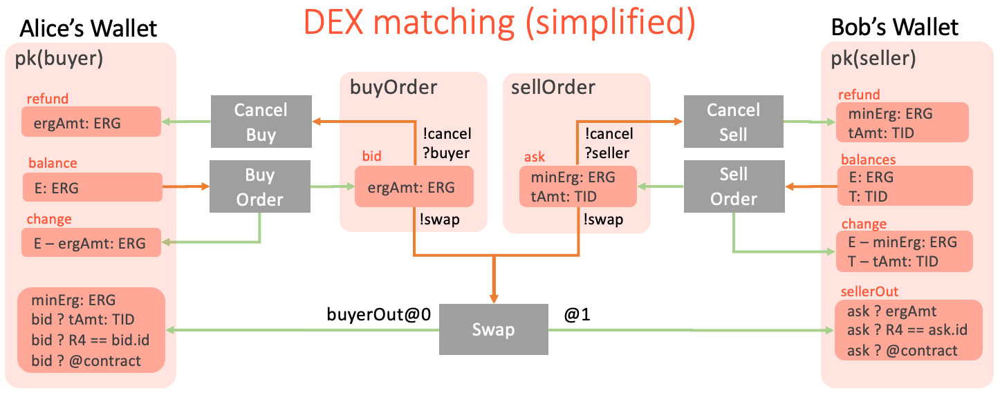

# ErgoFlow: A Graphical Notation for Designing of Ergo Contracts

### Why does it matter? 

[ErgoScript](https://ergoplatform.org/docs/ErgoScript.pdf) is the contracts language on
the Ergo blockchain. Even though it has concise syntax adopted from Scala, it still may
seem confusing at first, because conceptually ErgoScript is quite different from the
conventional languages which we all know and love.

It is because Ergo's programming model is declarative whereas conventional programming is
imperative. In the declarative model of Ergo you need to tell the system what it should do
for you leaving it the freedom of choosing how it will be achieved. The typical question
"How I can send ERGs to Alice in ErgoScript?" should be rephrased as "What I should tell
the system so that Alice gets the coins?". From this perspective ErgoScript is one piece
of the puzzle, and the transactions API of
[Appkit](https://github.com/aslesarenko/ergo-appkit) is the other (we will talk about this
later in this post).

Declarative programming models has already won the battle against imperative programming
in many application domains like Big Data, Stream Processing, Deep Learning, Databases,
etc. In a long term declarative model is also going to win the hearts of dApp developers.

In this post I want to introduce a graphical notation which can help in designing of complex
Ergo contracts in a declarative way.

### From Imperative to Declarative

In the imperative programming model of Ethereum a transaction is a sequence of operations
executed by Ethereum VM. The following [Solidity
function](https://solidity.readthedocs.io/en/develop/introduction-to-smart-contracts.html#subcurrency-example)
implements a transfer of tokens from `sender` to `receiver`. The transaction starts when
`sender` calls this function on an instance of the contract and ends when the function
returns.

```
// Sends an amount of existing coins from any caller to an address
function send(address receiver, uint amount) public {
    require(amount <= balances[msg.sender], "Insufficient balance.");
    balances[msg.sender] -= amount;
    balances[receiver] += amount;
    emit Sent(msg.sender, receiver, amount);
}
```

The function first checks the pre-conditions, then updates the storage (i.e. balances) and
then publish the post-condition as Sent event. The gas consumed by transaction is sent
to the miner as a reward for executing this transaction.

Unlike Ethereum, in Ergo, a transaction is a mapping between input coins which it spends
and output coins which it creates preserving total balances of ERGs and tokens (in which
Ergo is similar to Bitcoin). 

Since Ergo natively support tokens for this specific example of sending tokens we don't
need to write any code in ErgoScript.
What we need instead is to create the 'send' transaction shown in the following figure,
which describe the same token transfer but declaratively.


We need in particular:
1) select unspent sender's boxes, containing in total `tB >= amount` of tokens and `B >=
txFee + minErg` ERGs
2) create one output (box) which is protected by `recipient` public key with `minErg` ERGs and
`amount` of tokens
3) create one _fee_ output protected by the minerFee contract with `txFee` ERGs 
4) create one _change_ output protected by `sender` public key, containing
`B - minErg - txFee` ERGs and `tB - amount` tokens.
5) create a new transaction, sign it using the sender's secret key and send to the Ergo
network.

Note, that all the transaction creation is done off-chain using Appkit Transaction API, thus it
is free of gas. To make it simple Appkit implements a library so
that the basic transactions like this can be created using a single method call.

Thus, when in the Ethereum contract "We send amount from sender to recipient" we literally
changing balances and update storage with the concrete set of commands, and this happens
on-chain. 

In Ergo (as in Bitcoin) transactions are created off-chain and the effects of the
transaction on the blockchain state is that input coins (or Boxes in Ergo's parlance) are
removed and output boxes are added to the
[UTXO](https://en.wikipedia.org/wiki/Unspent_transaction_output) set, this happens
atomically (all or nothing), and no contract code is necessary in this simple example.

However in more complex application scenarios we do need to use ErgoScript code and this
is what we are going to discuss next.

### From Changing State to Checking Context 

In the `send` function example we first check the pre-condition (`require(amount <=
balances[msg.sender],...)`) and then change the state (i.e. update balances
`balances[msg.sender] -= amount`). This is typical in Ethereum transactions, before
we change anything we need to check if it is valid to do at all.

In Ergo, as we discussed, the state (i.e. UTXO set of boxes) is changed implicitly when a
transaction is included in a block. Thus we only need to check the pre-conditions before
the transaction can be added to the block. This is where ErgoScript comes into a play.

It is not possible to "change the state" in ErgoScript because it is a language to check
pre-conditions for spending coins. ErgoScript is purely functional language, without side effects
operating with immutable data values. This means all the inputs, outputs and other
transaction parameters available in a script are immutable. This, among other things,
makes ErgoScript a very simple language, easy to learn and safe to use. Similar to
Bitcoin, each input box contains a script, which should be executed to the `true` value in
order to 1) allow spending of the box (i.e. removing from the UTXO set) and 2) add
the transaction to the block.

It is therefore inaccurate to say that ErgoScript is the language of Ergo contracts,
because it is the language of propositions (of logical predicates, formulas, etc.)
protecting boxes from "illegal" spending. Unlike Bitcoin, in Ergo the whole
transaction content as well as the current blockchain context is available in every
input's script. So each input script may check which outputs are created by the transaction,
their ERG and token amounts. 

While the Ergo's transaction model unlocks the whole range of applications like (DEX, DeFi
Apps, LETS, etc), designing contracts as pre-conditions (or guarding scripts) directly is
not intuitive. In the next section I will introduce useful graphical notation to design
contracts declaratively as diagrams.

### Graphical Notation

The idea behind diagrams is based on the following observations. Ergo boxes are immutable
and cannot be changed. The only thing that can happen with a box is that it can be spent
in a transaction (which in this case should take it as an input). We therefor can draw a
flow of boxes through transactions, so that boxes _flowing in_ to the transaction are
spent and those _flowing out_ are created and added to UTXO. A transaction from this
perspective is a transformer of old boxes to new ones preserving the balances of ERGs and
tokens involved.

The following figure show the main elements of the transaction we already saw previously. 


There is a strictly defined meaning (aka semantics) behind every element of _the diagram_,
so that the diagram is in fact a _formalized specification_, which can be used to
mechanically create and send the corresponding transaction to Ergo blockchain, we will see
this in the next section.

Another way to look at the diagram as an executable spread-sheet-like flow of ERGs and
tokens between boxes, where all transaction balances and conditions are validated.

Now let's look at the pieces of the diagram one by one.

##### 1. Contract Wallet 

This is a key element of the diagram. Every box has a guarding script. Most often it is
the script that contains a public key and checks a signature generated using the
corresponding secret key. This script is trivial in ErgoScript and looks like `{ sender
}`, where sender is the named template parameter. We call the corresponding script template
`pk(pubkey)`, which has one parameter.

_Contract Wallet_ is then a set of all UTXO boxes which have a script with a given
template and given parameter. In the figure, the template is `pk` and parameter `pubkey`
is substituted with `sender' (address or public key).
  
##### 2. Contract

Even though a contract is a property of a box, on the diagram we group the boxes by
their contracts. In the example, we have three instantiated contracts pk(sender),
pk(receiver) and minerFee. Note, that `pk(sender)` is the instantiation of the `pk`
template with the concrete parameter `sender`.

##### 3. Box name

In the diagram we can give each box a name. Besides readability of the diagram, the name
can then be used as a synonym of a more complex indexed access to the box in the
contract. For example, `change` is the name of the box, which can also be accessed in the
ErgoScript contract as `OUTPUTS(2)`. Box names can
also be used to specify conditions that should be checked in its script (more about it
later).

##### 4. Boxes of the wallet

In the diagram, we show boxes (darker rectangles) as belonging to the contract wallets
(lighter rectangles). Each such _box rectangle_ is connected with a grey _transaction
rectangle_ by either <b color="#ED7D31">orange</b> or <b color="#A9D18E">green</b> arrows
or both. An output box (with incoming green arrow) may include many lines of text where each
line specifies a condition which should be checked as part of the transaction. The first
line specifies the condition on the amount of ERG which should be placed in the box. Other
lines may take one of the following form:
1) `amount: TOKEN` - the box should contain the given `amount` of the given `TOKEN`
2) `R == value` - the box should contain the given `value` of the given register `R`
3) `boxName ? condition` - the box named `boxName` should check `condition` in its script.


##### 5. Amount of ERGs in the box

Each box should store some minimum amount of ERGs which is checked when a transaction is
validated. In the diagram the amount of ERGs is _always_ shown as the first line (e.g. `B:
ERG` or `B - minErg - txFee`). The value type specification `B: ERG` is optional and may
be used for readability. When the value is given as formula, then this formulate should be
respected by the transaction which creates the box.

##### 6. Amount of T token 

A box can store values of many tokens. The tokens on the diagram are named and the `value`
may be associated with the token `T` using `value: T` expression. The `value` may be given
by formula. If the formula is prefixed with a box name like `boxName ? formula`, then it
is also should be checked in the guarding script of the `boxName` box. This additional
specification is very convenient because 1) it allows to validate visual design, and 2) in
many cases the conditions specified in the boxes of a diagram are enough to synthesize the
necessary guarding contracts. (more about this
[below](#from-diagrams-to-ergoscript-contracts))

##### 7. Tx Inputs

Inputs are connected to the corresponding transaction by <b color="#ED7D31">orange</b>
arrows. An input arrow may have a label of the following forms:
1) `name@index` - optional name with an index i.e. `fee@0` or `@2`. This is a property of
the target endpoint of the arrow. The name can be used in conditions of the related boxes
and the `index` is the position of the corresponding box in INPUTS collection of the
transaction.
2) `!action` - is the propety of source of the arrow and gives a name for an alternative
spendings of the box (we will see this in DEX example)

Because of alternative spendings, a box may have many outgoing <b
color="#ED7D31">orange</b> arrows, in which case they should be labeled with different
actions.

##### 8. Transaction

A transaction spends input boxes and creates output boxes. The input boxes are given by
the <b color="#ED7D31">orange</b> arrows and the labels are respected to put inputs at the
right indexes in INPUTS collection. The output boxes are given by the <b
color="#A9D18E">green</b> arrows. Each transaction should preserve a strict balance of ERG
values (sum of inputs == sum of outputs) and for each token the sum of inputs >= the sum
of outputs. The design diagram however requires an explicit specification of the ERG and
token values for all the output boxes to avoid implicit errors and have better readability.

##### 9. Tx Outputs
Outputs are connected to the corresponding transaction by <b color="#A9D18E">green</b>
arrows. An output arrow may have a label of the following form`name@index` - optional name
with an index i.e. `fee@0` or `@2`. This is a property of the source endpoint of the
arrow. The name can be used in conditions of the related boxes and the `index` is the
position of the corresponding box in OUTPUTS collection of the transaction.

### More Complex Example: Decentralized Exchange (DEX)

Now let's use the described notation to design contracts for a DEX dApp. It is
simple enough for a post, but it also illustrates all the primitives of the graphical
language we've introduced.

There are three participants (buyer, seller and DEX) of the DEX dApp and five different
transaction types, which can be created by participants. The buyer wants to swap `ergAmt`
ERGs for `tAmt` of `TID` tokens (of vice versa, who send the orders first doesn't matter).
Both the buyer and the seller can cancel their orders. The DEX off-chain service can find
matching orders and create a special `Swap` transaction to complete the exchange.

The following diagram fully specifies all the five transactions and the box spending
conditions that should be satisfied.



Let's see look at the specification of each transaction:

##### BuyOrder Transaction

The transaction spends `E` amount of ERGs (which we will write `E: ERG`) from one or more
boxes in the `pk(buyer)` wallet. The transaction creates a `bid` box with `ergAmt: ERG`
protected by the `buyOrder` contract. The `buyOrder` contract is synthesizable from the
specification (we will discuss this in the next section) either manually or automatically
by a tool. Even though we don't need to define the `buyOrder` contract explicitly during
the design time, at running time the `bid` box should contain the `buyOrder` contract as
the guarding script, otherwise the conditions specified in the diagram will not be checked.

The `change` box is created to make the input and output sums of the transaction balanced.
The transaction fee box is omited for simplicity, in practice, it should be added
explicitly because in the case of more complex transactions (like Swap) there are many
ways to pay transaction fee.

##### CancelBuy, CancelSell Transactions

At any time, the `buyer` can cancel the order by sending `CancelBuy` transaction. The
transaction should satisfy the guarding `buyOrder` contract which protects the `bid` box.
As you can see on the diagram, both the `Cancel` and the `Swap` transactions can spend the
`bid` box. When a box have spending alternatives (or _spending path_) then each
alternative should be identified by unique name prefixed with `!` (`!cancel` and `!swap`
for the `bid` box). Each alternative have specific spending conditions. In our example,
when the `bid` box is spend by the `Cancel` transaction the `?buyer` condition should be
satisfied, which can be read as "the signature of the buyer should be presented in the
transaction". Therefore, only buyer can cancel the buy order. This "signature" condition
is only required for `!cancel` spending alternative and not required for `!swap`.

##### SellOrder Transaction

The `SellOrder` transaction is similar to the `BuyOrder` it has to do with tokens in
addition to ERGs. The transaction spends `E: ERG` and `T: TID` tokens from seller's wallet
(specified as `pk(seller)` contract). The two outputs are `ask` and `change`. The change
is a standard box to balance transaction. The `ask` box stores `tAmt: TID` tokens to swap
and the `minErg: ERG` - a minimum amount of ERGs required in every box.

##### Swap Transaction

This is a key transaction in the DEX scenario. The transaction has many of spending
conditions on the input boxes and those conditions are included in the `buyOrder` and
`sellOrder` contracts and consequently verified when the transaction is added to the
blockchain. However, on the diagram those conditions are not specified in the `bid` and
`ask` boxes, they are instead defined in the output boxes of the transaction. 

This is because most of the conditions relate to the properties of the output boxes. This is
usability convention, we could specify those properties in the `bid` box but, then we would
had to use more complex expressions.

Let's take the output created by the arrow labeled with `buyerOut@0`. This label tell us
that the output is at the index `0` in the `OUTPUTS` collection of the transaction and that
we can refer to this box by the `buyerOut` name. Thus we can label both the box itself and
the arrow to give it a name.

The conditions shown in the `buyerOut` box have the form `bid ? condition`, which means
they should be checked before the `bid` box can be spent. 
The conditions have the following meaning:
1) `tAmt: TID` require the box to have `tAmt` amount of `TID` token
2) `R4 == bid.id`  require R4 register in the box to be equal to id of the
`bid` box.
3) `@contract` require the box to have the contract of the wallet where it is located on
the diagram, i.e. `pk(buyer)`

Similar properties are added to the `sellerOut` box, which is specified to be at index `1`
and the name is given using label on the box itself, rather than on the arrow.

The `Swap` transaction spends two boxes `bid` and `ask` using the `!swap` spending path,
however unlike `!cancel` the conditions on the path are not specified. This is where the
`bid ?` and `ask ?` prefixes come into play, so the conditions on the `buyerOut` and
`sellerOut` boxes are moved to the `!swap` spending path of the `bid` and `ask` boxes
correspondingly.

If you look at the conditions of the output boxed, you will see that they exactly specify
the swap of values between seller's and buyer's wallets. Buyer get's the necessary amount
of `TID` token and seller get's the corresponding amount of ERGs. The `Swap` transaction
can be created when there are two matching boxes with `buyOrder` and `sellOrder` contracts.

### From Diagrams To ErgoScript Contracts

What is nice about formalized graphical notation is that we can use it to mechanically
generate the necessary ErgoScript contracts. With tooling support this can be done
automatically, with a lack of thereof, it can be done manually. This is what we are going
to do next, create the `buyOrder` contract from the information given in the diagram.

Recall that each contract is a proposition (boolean valued expression) which should
evaluate to the `true` value. When we have many conditions to be met at the same time we
can combine them in a logical formula using AND binary operation, and if we have
alternatives (not necessarily exclusive) we can put them into OR operation. 

The `buyOrder` box have the alternative spending paths `!cancel` and `!swap`. Thus the
ErgoScript code should have OR operation with two arguments, one for each spending path.
```
/** buyOrder contract */
{
  val cancelCondition = {}
  val swapCondition = {}
  cancelCondition || swapCondition
}
```
The formula for the `cancelCondition` expression is given in the `!cancel` spending path
of the `buyOrder` box, we can directly include it in the script
```
/** buyOrder contract */
{
  val cancelCondition = { buyer }
  val swapCondition = {}
  cancelCondition || swapCondition
}
```

For the `!swap` spending path of the `buyOrder` box the conditions are specified in the
`buyerOut` output box of the `Swap` transaction. If we simply include them in the
`swapCondition` then we get incorrect script.
```
/** buyOrder contract */
{
  val cancelCondition = { buyer }
  val swapCondition = {
    tAmt: TID &&
    R4 == bid.id &&
    @contract
  }
  cancelCondition || swapCondition
}
```
We can however transform the conditions from the diagram syntax to ErgoScript expressions
using the following simple rules
1) `tAmt: TID`  ==> `tid._2 == tAmt` where `tid = buyerOut.tokens(TID)`
2) `R4 == bid.id`  ==> `R4 == SELF.id` where `R4 = buyerOut.R4[Coll[Byte]].get` 
3) `@contract`  ==> `buyerOut.propositionBytes == buyer.propBytes` where `R4 = buyerOut.R4[Coll[Byte]].get` 
4) `buyerOut@0` ==> `val buyerOut = OUTPUTS(0)`

After transformation we can get the correct script which checks all the required
preconditions for spending the `buyOrder` box.
```
/** buyOrder contract */
{
  val cancelCondition = { buyer }
  val swapCondition = try {
    val buyerOut = OUTPUTS(0)                     // from buyerOut@0
    val tid = buyerOut.tokens(TID)
    val R4 = buyerOut.R4[Coll[Byte]].get
    tid._2 == tAmt &&                             // from tAmt: TID 
    R4 == SELF.id &&                              // from R4 == bid.id
    buyerOut.propositionBytes == buyer.propBytes  // from @contract
  }
  cancelCondition || swapCondition
}
```
A similar script for the `sellOrder` box can be obtained using the same rules.

### From Diagrams To Appkit Transactions

### Conclusions

### References


