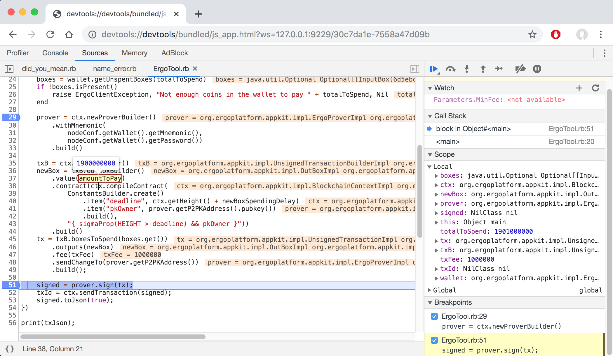

# 5 Ways Ergo Application Development Is Changed Forever Thanks To Appkit

> With thanks to [Robert Kornacki](https://github.com/robkorn) and [Denys Zadorozhnyi](https://github.com/greenhat).

[Ergo Appkit](https://github.com/ergoplatform/ergo-appkit) is a library for
polyglot development of Ergo Applications based on
[GraalVM](https://www.graalvm.org/). GraalVM has many [great
use cases](https://medium.com/graalvm/graalvm-ten-things-12d9111f307d). Expanding on that, in this article we will go through some of the Appkit
features inherited from GraalVM and take you step-by-step in learning how to take advantage of them.

- [0. Example Scenario](#example-scenario)
- [1. Java Ergo App Development](#1-java-ergo-app-development)
- [2. Low-footprint, Fast-startup Ergo Applications](#2-low-footprint-fast-startup-ergo-applications)
- [3. Develop Ergo Applications in JavaScript, Python, Ruby](#3-develop-ergo-applications-in-javascript-python-ruby)
- [4. Ergo Native Shared Libraries](#4-ergo-native-shared-libraries)
- [5. Debug Your Polyglot Ergo Application](#5-debugging-your-polyglot-ergo-application)

## Example Scenario

We will create a simple console application (called
[FreezeCoin](https://github.com/aslesarenko/ergo-appkit-examples/blob/master/java-examples/src/main/java/org/ergoplatform/appkit/examples/FreezeCoin.java))
in Java which uses the Appkit library. By using Appkit, we will be able to easily send a new transaction to an Ergo node programatically. The
transaction will transfer a given amount of Erg into a new box protected by the
following Ergo contract written in ErgoScript (see this
[introduction](https://ergoplatform.org/docs/ErgoScript.pdf) and more [advanced
examples](https://ergoplatform.org/docs/AdvancedErgoScriptTutorial.pdf) to learn more about ErgoScript).
```
// Freezer Contract
{ 
  // Parameters
  // freezeDeadline: Int - some future block number after which the box can be spent
  // ownerPk: SigmaProp - public key of the new box owner
  sigmaProp(HEIGHT > freezeDeadline) && ownerPk
}
```
In short, a box (and therefore the funds within the box) are locked under a contract (or script) on the Ergo blockchain. In order for the box to be spent, the contract must evaluate to true. Thus the individual who wishes to spend the box must ensure that the contract evaluates to true based off of the encoded logic within it.

Our Freezer contract above checks the following conditions before allowing the box to be spent:
1) The current block number of the Ergo blockchain (aka blockchain HEIGHT) is 
greater than the specified deadline
2) The spending transaction must be signed by the owner of the secret key
corresponding to the ownerPk public key.

The first condition forbids anyone from spending the box before the Ergo
blockchain grows to the given height. Because new blocks on the blockchain are mined approximately every 2 minutes on average, using the current
blockchain height it is easy to define any duration of delay we wish such as 1 day, 1 week, or 1 month. *(i.e. (60/2) * 24 * 7 = 5040, which is the # of blocks per week)*.

We will now be going in depth on how we can take this Freezer Contract and integrate it with the Apkit library in order to create the FreezeCoin console application so that anyone and everyone can choose to freeze their coins if they so wish. (Granted, this contract/dApp is not actually useful, however it is an effective simple example for displaying how this technology stack works so that you yourself can build useful dApps down the line.)


## 1. Java Ergo App Development

Appkit aims to provide a set of interfaces which can be used idiomatically
in Java. You will feel right at home using Appkit if you are a Java veteran.

Please follow the [setup
instructions](https://github.com/ergoplatform/ergo-appkit#setup) for GraalVM and
Appkit if you wish to reproduce the examples below.

To use Appkit in our Java implementation of FreezeCoin we must add the
following dependency in the [gradle
file](https://github.com/aslesarenko/ergo-appkit-examples/blob/master/java-examples/build.gradle.kts)

```kotlin
dependencies {
    implementation("org.ergoplatform", "ergo-appkit_2.12", "3.1.0", "compile")
    ...
}
```

Furthermore at runtime Appkit/our application needs to connect with an Ergo Node via REST API. Often,
the node will be running locally and made available at `http://localhost:9052/`. This is the standard scenario for anyone who has set up a full-node by following [these
instructions](https://github.com/ergoplatform/ergo/wiki/Set-up-a-full-node) and is using the default configuration.

Henceforth we will assume that you have setup and started your Ergo Node so that it is available for testing of the application.

Next, our application will need to know how to be able to a connect to our local running node, in addition to other various settings in order to function properly. We will use a json file with the following
configuration parameters which our FreezeCoin app will load at startup. 

[freeze_coin_config.json:](https://github.com/aslesarenko/ergo-appkit-examples/blob/master/freeze_coin_config.json)

```json
{
  "node": {
    "nodeApi": {
      "apiUrl": "http://localhost:9052/",
      "apiKey": "put your secret apiKey generated during node setup here"
    },
    "wallet": {
      "mnemonic": "the mnemonic key used to initialize or restore the wallet of the node",
      "password": "the password you chose to protect the wallet",
      "mnemonicPassword": "the password you chose to protect the mnemonic"
    },
    "networkType": "TESTNET"
  },
  "parameters": {
    "newBoxSpendingDelay": "30",
    "ownerAddress": "3WzR39tWQ5cxxWWX6ys7wNdJKLijPeyaKgx72uqg9FJRBCdZPovL"
  }
}
```
Here `apiKey` is the secret key required for API authentication which can be
acquired as described
[here](https://github.com/ergoplatform/ergo/wiki/Ergo-REST-API#setting-an-api-key).
Your mnemonic is the secret phrase obtained during [setup of a new
wallet](https://github.com/ergoplatform/ergo/wiki/Wallet-documentation).

----
How our app will work is that the user will launch it from the command line and provide one argument. This argument is the amount of value (in NanoErgs) which they wish to freeze/lock under the Freezer contract which we wrote above.

Our first step for our FreezeCoin app will be to read the configuration json file we just created and to accept the command line argument from the user:
```java
public static void main(String[] args) {
    long amountToSend = Long.parseLong(args[0]);  // positive value in NanoErg
    ErgoToolConfig conf = ErgoToolConfig.load("freeze_coin_config.json");
    // the rest of the code discussed below 
    ...
}
```

With these acquired, we can now obtain the spending delay and the owner address which were defined in the json config file.

```java
  int newBoxSpendingDelay = Integer.parseInt(conf.getParameters().get("newBoxSpendingDelay"));
  Address ownerAddress = Address.create(conf.getParameters().get("ownerAddress"));
```

Next we need to connect to the running Ergo node from our Java application so that we can use the data we just parsed and post something on-chain. This is done by creating
an `ErgoClient` instance which uses our pre-defined values for our node from the json config file as well.
```java
ErgoNodeConfig nodeConf = conf.getNode();
ErgoClient ergoClient = RestApiErgoClient.create(nodeConf);
```

Now that we have an instance of [ErgoClient](https://github.com/ergoplatform/ergo-appkit/blob/master/lib-api/src/main/java/org/ergoplatform/appkit/ErgoClient.java),
we can execute any block of code and have access to the current blockchain context.

```java
String txJson = ergoClient.execute((BlockchainContext ctx) -> {
    // use ctx here to create and sign a new transaction
    // then send it to the node 
});
```

The lambda passed to `execute` is called when the current blockchain context
is loaded from the Ergo node. In this lambda we
shall put our application logic. 

First we start with some auxiliary steps.
```java
// access the wallet embedded in the Ergo node 
// (using the wallet specified via mnemonic we put in freeze_coin_config.json)
ErgoWallet wallet = ctx.getWallet();

// calculate total amount of NanoErgs we need to send to the new box 
// including paying for transaction fees
long totalToSpend = amountToSend + Parameters.MinFee;

// request for unspent boxes that cover the required amount of NanoErgs from the wallet
Optional<List<InputBox>> boxes = wallet.getUnspentBoxes(totalToSpend);
if (!boxes.isPresent())
    throw new ErgoClientException(
        "Not enough coins in your specified wallet to pay " + totalToSpend, null);
    
// create a "prover", which is a special object that will be used for signing the transaction
// the prover should be configured with your wallet's secrets, which are necessary to generate signatures (aka proofs)
ErgoProver prover = ctx.newProverBuilder()
    .withMnemonic(
            nodeConf.getWallet().getMnemonic(),
            nodeConf.getWallet().getPassword())
    .build();
```

At this point we have the input boxes chosen for our spending transaction, but we now need to create an output box with the specified `amountToSend` and locked under the Freezer contract.

```java
// the only way to create a transaction is using the tx builder obtained from the context
// the builder uses the context to access necessary blockchain data.
UnsignedTransactionBuilder txB = ctx.newTxBuilder();

// create new box using new builder obtained from the transaction builder
// in this case we compile a new ErgoContract from the Freezer ErgoScript code
OutBox newBox = txB.outBoxBuilder()
        .value(amountToPay)
        .contract(ctx.compileContract(
                ConstantsBuilder.create()
                        .item("freezeDeadline", ctx.getHeight() + newBoxSpendingDelay)
                        .item("ownerPk", ownerAddress.getPublicKey())
                        .build(),
                "{ sigmaProp(HEIGHT > freezeDeadline) && ownerPk }"))
        .build();
```
Note, in order to compile `ErgoContract` from the Freezer script source code the `compileContract`
method requires that we provide values for named constants which are used within the script.
If no such constants are used, then `ConstantsBuilder.empty()` can be passed to it.

In this case we pass the public key of the new box owner into the `ownerPk` 
placeholder in the script. To repeat from earlier, this means that the box can only be spent by the owner of the
corresponding secret key. 

Next, we create an unsigned transaction using all the data we've put together thus far.
```java
// provide the transaction builder with which boxes we are going to spend, which outputs
// should be created, the total transaction fees, and the address for change to be sent to
UnsignedTransaction tx = txB.boxesToSpend(boxes.get())
        .outputs(newBox)
        .fee(Parameters.MinFee)
        .sendChangeTo(prover.getP2PKAddress())
        .build();
```

And finally we:
1) Use the prover to sign the built transaction
2) Thus obtain a
`SignedTransaction` instance
3) Use the blockchain context to send the signed transaction to
the Ergo node. 

The resulting `txId` can be used to refer to this transaction
later however we do not use it here.
```java
SignedTransaction signed = prover.sign(tx);
String txId = ctx.sendTransaction(signed);
return signed.toJson(true);
```

As you may have noticed, for our final step we show off that it is possible to serialize the signed
transaction into a Json string with pretty printing turned on. Look at the [full
source code](https://github.com/aslesarenko/ergo-appkit-examples/blob/master/java-examples/src/main/java/org/ergoplatform/appkit/examples/FreezeCoin.java)
of the example for more details and for using it as a template in your own
application.

---

Now with all of the code set in stone, we can run our FreezeCoin application using the following steps
(assuming you are in the directory where you cloned
[ergo-appkit-examples](https://github.com/aslesarenko/ergo-appkit-examples)).
```shell
$ pwd
the/directory/you/cloned/ergo-appkit-examples
$ ./gradlew clean shadowJar 
```
This will assemble the `build/libs/appkit-examples-3.1.0-all.jar` file containing
our FreezeCoin Java application and all of its dependencies in a single fat jar. 
Note, this step has to be repeated after any changes are made to the Java source code of our application.

Having created our application, we can now use our FreezeCoin app:
```shell
$ java -cp build/libs/appkit-examples-3.1.0-all.jar \
      org.ergoplatform.appkit.examples.FreezeCoin  1000000000 
```
You will get something along the lines of this [output in the console](https://gist.github.com/aslesarenko/cacee372350458ac31bd5c73e957e322).

And with that your transaction was accepted by the Ergo node and broadcast into the network where it shall lay await in the transaction pool to be added to a block. Once a miner selects and adds it to a block, your coins will be officially "frozen" within the newly created box based off of the values you provided to the FreezeCoin application.

The example assumes the Ergo node (and the embedded wallet) is owned by the
FreezeCoin user. However this is not strictly required and the Appkit interfaces
can be used to create and send new transactions using arbitrary public Ergo
nodes.

## 2. Low-footprint, Fast-startup Ergo Applications

As you may know, using Java for short-running processes has a lot of drawbacks.
Applications tend to suffer from long startup times and relatively high memory usage.

Let's run FreezeCoin using the time command to
get the real (wall-clock elapsed time) it takes the entire program to run from
start to finish. We use the `-l` flag to print the memory usage as well.
```shell
$ /usr/bin/time -l java -cp build/libs/appkit-examples-3.1.0-all.jar \
   org.ergoplatform.appkit.examples.FreezeCoin 1000000000
...
       4.97 real         8.41 user         0.69 sys
 513703936  maximum resident set size
         0  average shared memory size
         0  average unshared data size
         0  average unshared stack size
    125010  page reclaims
      1216  page faults
         0  swaps
         0  block input operations
         0  block output operations
        13  messages sent
        86  messages received
         1  signals received
      2384  voluntary context switches
     17409  involuntary context switches
```
As seen above, this tiny application took 2 parallel threads almost 4
seconds to run. Most of that time can be attributed to the JVM startup and
the background JIT compiler running. This is quite sub-par performance, and we know we can do a lot better.

Luckily, GraalVM provides us with the perfect solution.

We can solve this inherent issue with the JVM by compiling the Java code
ahead-of-time into a native executable image via GraalVM. This skips over the need to use the Java just-in-time compiler
at runtime. 

The experience for us (the developer using GraalVM) is quite similar to a conventional compiler like gcc. Note,
we may need to run `./gradlew clean shadowJar` first.
```
$ ./gradlew clean shadowJar
$ native-image --no-server \
 -cp build/libs/appkit-examples-3.1.0-all.jar\
 --report-unsupported-elements-at-runtime\
  --no-fallback -H:+TraceClassInitialization -H:+ReportExceptionStackTraces\
   -H:+AddAllCharsets -H:+AllowVMInspection -H:-RuntimeAssertions\
   --allow-incomplete-classpath \
    --enable-url-protocols=http,https org.ergoplatform.appkit.examples.FreezeCoin freezecoin
[freezecoin:3133]    classlist:  35,217.78 ms
[freezecoin:3133]        (cap):   6,063.07 ms
[freezecoin:3133]        setup:   8,268.99 ms
[freezecoin:3133]   (typeflow):  60,238.25 ms
[freezecoin:3133]    (objects):  33,009.06 ms
[freezecoin:3133]   (features):   4,796.86 ms
[freezecoin:3133]     analysis: 102,876.01 ms
[freezecoin:3133]     (clinit):  11,642.43 ms
[freezecoin:3133]     universe:  13,718.96 ms
[freezecoin:3133]      (parse):   5,053.18 ms
[freezecoin:3133]     (inline):  18,317.24 ms
[freezecoin:3133]    (compile):  44,806.82 ms
[freezecoin:3133]      compile:  72,288.24 ms
[freezecoin:3133]        image:   7,955.29 ms
[freezecoin:3133]        write:   2,872.25 ms
[freezecoin:3133]      [total]: 243,813.30 ms
```

The simple command above produces a complete native executable called `freezecoin`. 

To emphasize, this executable isn’t a mere launcher for the JVM. In fact it doesn’t link to the JVM or bundle
the JVM in any way. `native-image` compiles the FreezeCoin code, as well as any
Java libraries it depends on, all the way down to simple machine code. 

If we look at the libraries which `freezecoin` uses you can see that it only uses standard system libraries. Thus, we can move just this one executable to another system
which doesn't have a JVM installed and it will run there without issue.
```
$ otool -L freezecoin    # ldd freezecoin on Linux
freezecoin:
	/usr/lib/libSystem.B.dylib (compatibility version 1.0.0, current version 1252.50.4)
	/System/Library/Frameworks/CoreFoundation.framework/Versions/A/CoreFoundation (compatibility version 150.0.0, current version 1455.12.0)
	/usr/lib/libz.1.dylib (compatibility version 1.0.0, current version 1.2.11)
```

If we time this new `freezecoin` executable, we can see that it starts approximately 8x faster, and uses
around 6x less memory. What this means is that you don’t feel that palpable pause you always get when running a
short-running program with the JVM.
```
$ DYLD_LIBRARY_PATH=$GRAAL_HOME/jre/lib /usr/bin/time -l ./freezecoin 1800000000
        0.43 real         0.15 user         0.03 sys
  81289216  maximum resident set size
         0  average shared memory size
         0  average unshared data size
         0  average unshared stack size
     20079  page reclaims
         0  page faults
         0  swaps
         0  block input operations
         0  block output operations
        13  messages sent
        86  messages received
         0  signals received
        11  voluntary context switches
       138  involuntary context switches
```
This is just one of the great benefits of GraalVM which we get to take advantage of with Appkit.

## 3. Develop Ergo Applications in JavaScript, Python, Ruby

GraalVM supports so called *polyglot programming* in which different components of
an application can be developed using the most suitable language and then
seamlessly combine together at runtime. In this way a unique library written in say
Java can be used in a node.js application written in JavaScript for example.

To support polyglot programming GraalVM platform has it's own high performance
implementations of popular languages. We are going to take advantage of this for 
our FreezeCoin example project to show you how easy this is to use your preferred language.

Before running the examples below (in JavaScript, Python and Ruby) please make sure that you have the
Java version of FreezeCoin working locally in order to ensure everything is set up correctly.

### JavaScript

GraalVM can [run JavaScript and
Node.js](https://www.graalvm.org/docs/reference-manual/languages/js/)
applications out of the box. It is compatible with the [ECMAScript 2019
specification](http://www.ecma-international.org/ecma-262/10.0/index.html).
Additionally, `js` and `node` launchers accept special `--jvm` and `--polyglot`
command line options which allow JS scripts to access Java objects and classes.

Given that being the case, a JS implementation of FreezeCoin can be easily written using the Appkit
API interface.
Please see the full source code of [FreezeCoin JS
implementation](https://github.com/aslesarenko/ergo-appkit-examples/blob/master/js-examples/FreezeCoin.js)
for details.
The following command use `node` launcher to execute FreezeCoin.js script.
```shell
$ node --jvm --vm.cp=build/libs/appkit-examples-3.1.0-all.jar \
  js-examples/FreezeCoin.js  1000000000
```
Note, the paths in the command are relative to the root of
`ergo-appkit-examples` project directory.

### Python

GraalVM can [run Python
scripts](https://www.graalvm.org/docs/reference-manual/languages/python/), though
the Python implementation is still experimental (see also
[compatibility section](https://www.graalvm.org/docs/reference-manual/languages/python/#python-compatibility)
for details).

[Python example of
FreezeCoin](https://github.com/aslesarenko/ergo-appkit-examples/blob/master/python-examples/FreezeCoin.py)
can be executed using the following command
```shell
$ graalpython --jvm --polyglot --vm.cp=build/libs/appkit-examples-3.1.0-all.jar \
   python-examples/FreezeCoin.py 1900000000
```

### Ruby

GraalVM can [run Ruby
scripts](https://www.graalvm.org/docs/reference-manual/languages/ruby/) using
TruffleRuby implementation, which is however still experimental (see also
[compatibility section](https://www.graalvm.org/docs/reference-manual/languages/ruby/#compatibility)
for details).
TruffleRuby aims to be fully compatible with the standard implementation of Ruby, MRI, version 2.6.2

[Ruby example of
FreezeCoin](https://github.com/aslesarenko/ergo-appkit-examples/blob/master/ruby-examples/FreezeCoin.rb)
can be executed using the following command
```shell
$ truffleruby --polyglot --jvm --vm.cp=build/libs/appkit-examples-3.1.0-all.jar \
    ruby-examples/FreezeCoin.rb 1900000000
```


## 4. Ergo Native Shared Libraries

Another great benefit of GraalVM is that we can compile Java classes down into a native shared library instead of an executable.

To do this we declare one or more static methods as the `@CEntryPoint`.

```java
public class FreezeCoin {
    ...
     /**
     * Entry point callable from C which wraps {@link FreezeCoin#sendTx}
     */
    @CEntryPoint(name = "sendTx")
    public static void sendTxEntryPoint(
            IsolateThread thread,
            SignedWord amountToSendW,
            CCharPointer configFileNameC,
            CCharPointer resBuffer, UnsignedWord bufferSize) throws FileNotFoundException {
        long amountToSend = amountToSendW.rawValue();
        // Convert the C strings to the target Java strings.
        String configFileName = CTypeConversion.toJavaString(configFileNameC);
        String txJson = sendTx(amountToSend, configFileName);

        // put resulting string into provided buffer
        CTypeConversion.toCString(txJson, resBuffer, bufferSize);
    }  
    ...
}
```

We can then compile down to a shared library and an automatically generated header
file. Notice the use of the `--shared` option.

```
$ native-image --no-server \
 -cp build/libs/appkit-examples-3.1.0-all.jar\
 --report-unsupported-elements-at-runtime\
  --no-fallback -H:+TraceClassInitialization -H:+ReportExceptionStackTraces\
   -H:+AddAllCharsets -H:+AllowVMInspection -H:-RuntimeAssertions\
   --allow-incomplete-classpath \
    --enable-url-protocols=http,https 
    --shared -H:Name=libfreezecoin -H:Path=c-examples
    
$ otool -L c-examples/libfreezecoin.dylib 
c-examples/libfreezecoin.dylib:
	.../c-examples/libfreezecoin.dylib (compatibility version 0.0.0, current version 0.0.0)
	/usr/lib/libSystem.B.dylib (compatibility version 1.0.0, current version 1252.50.4)
	/System/Library/Frameworks/CoreFoundation.framework/Versions/A/CoreFoundation (compatibility version 150.0.0, current version 1455.12.0)
	/usr/lib/libz.1.dylib (compatibility version 1.0.0, current version 1.2.11)
```

Now we have the ability to write a [C
program](https://github.com/aslesarenko/ergo-appkit-examples/blob/master/c-examples/freezecoin.c)
which uses the library.
 The interface to our native library does have a bit of 
boilerplate (because the VM needs to manage a heap, threads, a garbage collector
and more), and thus we need to create an instance and provide it
our main thread.

```
#include <stdlib.h>
#include <stdio.h>

#include <libfreezecoin.h>

int main(int argc, char **argv) {
  graal_isolate_t *isolate = NULL;
  graal_isolatethread_t *thread = NULL;
  
  if (graal_create_isolate(NULL, &isolate, &thread) != 0) {
    fprintf(stderr, "graal_create_isolate error\n");
    return 1;
  }

  char * configFileName = "freeze_coin_config.json";

  // get amountToSend from cmd args and call transaction creation
  long amountToSend = atol(argv[1]);
  char result[1024 * 16];
  sendTx(thread, amountToSend, configFileName, result, sizeof(result));

  // print out serialized result
  printf("%s\n", result);

  if (graal_detach_thread(thread) != 0) {
    fprintf(stderr, "graal_detach_thread error\n");
    return 1;
  }
  return 0;
}
```

We can compile this with our standard system tools and easily run our executable (set `LD_LIBRARY_PATH=.` on Linux).
```
$ clang -Ic-examples -Lc-examples -lfreezecoin c-examples/freezecoin.c -o call_freezecoin
$ otool -L call_freezecoin
$ DYLD_LIBRARY_PATH=$GRAAL_HOME/jre/lib ./call_freezecoin 1000000000
```


## 5. Debugging Your Polyglot Ergo Application

You can debug JS, Python and Ruby in IntelliJ, but if for some reason this
doesn't work for you or fit with your preferred editor, GraalVM offers another option.

All of the GraalVM languages (except for Java) are implemented using the common
[Truffle framework](https://github.com/oracle/graal/tree/master/truffle).
Truffle allows for tooling like debuggers to be implemented once and be available
for all supported languages.

As such we can run our program with the flag `--inspect` which will give us a link to
open in Chrome and will pause the program in the debugger.

```
$ ruby --polyglot --jvm --inspect --vm.cp=build/libs/appkit-examples-3.1.0-all.jar \
    ruby-examples/FreezeCoin.rb 1900000000
Debugger listening on port 9229.
To start debugging, open the following URL in Chrome:
    chrome-devtools://devtools/bundled/js_app.html?ws=127.0.0.1:9229/30c7da1e-7558a47d09b
...
```

From here we can set breakpoints and continue execution. When it breaks we’ll see
values of the variables, can continue again until the next breakpoint, and do everything we've come to expect from debuggers.


    
## Conclusions

And with all of that said and done, we see just how easy it is to use Appkit to
develop Ergo Applications. Appkit relies on the same exact core libraries which
were used in implementing the Ergo consensus protocol. These libraries include
the ErgoScript compiler, cryptography, byte code interpreter, data serialisers
and the other core components. Using GraalVM we are able to reuse these tried
and tested components in different application contexts without any modification
or rewriting them ourselves.

No matter if you are using Java, JavaScript, Python or Ruby, you can take
advantage of Appkit with GraalVM to drastically simplify the process of
interacting with the Ergo blockchain while creating native-running (d)Apps.

Stay tuned. In future posts we will introduce you to other interesting potential
applications powered by Appkit.


## References

1. [Ergo Site](https://ergoplatform.org/en/)
2. [Ergo Sources](https://github.com/ergoplatform/ergo)
3. [Ergo Appkit](https://github.com/ergoplatform/ergo-appkit)
4. [Ergo Appkit Examples](https://github.com/aslesarenko/ergo-appkit-examples)
5. [GraalVM](https://www.graalvm.org)
